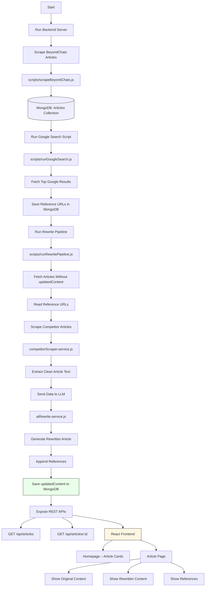

# beyondchats-task
> Full Stack Web Developer Intern assignment at BeyondChats

A modular, production-style system featuring a backend API for managing articles, automated scraping and AI-based rewriting scripts, and a React frontend for displaying original and updated content.

## 📁 Project Structure

```
beyondchats-assignment/
├── backend/          # Express + MongoDB backend
├── frontend/         # React frontend (UI)
└── scripts/          # Automation & scraping scripts
```

## 🧠 Project Phases

**Phase 1 – Backend & Scraping**
- Scrape oldest articles from BeyondChats
- Store them in a database
- Provide CRUD APIs

**Phase 2 – Automation & AI**
- Search Google for related articles
- Scrape top-ranking external blogs
- Use an LLM to rewrite content
- Store updated versions with references

**Phase 3 – Frontend**
- Display original and updated articles
- Clean, responsive UI
- Easy comparison view

## 🛠 Tech Stack

| Layer | Technologies |
|-------|--------------|
| Backend | Node.js, Express.js, MongoDB, Cheerio, Axios |
| Automation | Google Search API, OpenAI API, Node.js |
| Frontend | React, Axios, CSS/Tailwind |

## 📌 Development Notes

- Features developed in small, meaningful commits
- Scripts separated from API logic intentionally
- README and architecture evolve with progress



## 🚀 Getting Started

### Prerequisites
- Node.js (v14+)
- MongoDB
- npm or yarn

### Installation & Setup

**1. Environment Variables (Backend)**
Create a `.env` file in the `backend/` folder:
```
PORT=5000
MONGODB_URI=your_mongodb_url
OPENAI_API_KEY=your_openai_api_key
SERPER_API_KEY=your_api_key
```

Create a `.env` file in the `frontend/` folder:
```
VITE_API_URL=backend_URL
```

**2. Backend Setup**
```bash
cd backend
npm install
```

**3. Run Backend**
```bash
npm run dev
```

4. **Run Scraping Scripts**
open a new terminal and run the scraping script:
```bash
node scripts/scrapeBeyondChats.js
```

5. **Search for Competitors**
After scraping, run the competitor search script:
```bash
node scripts/searchCompetitors.js
```

6. **Rewrite Articles**
Finally, run the article rewriting pipeline:
```bash
node scripts/runRewritePipline.js
```

**7. Frontend Setup** 
```bash
cd ./frontend
npm i
```

**8. Run Frontend**
```bash
npm run dev
```
Make sure to check the console for any errors during execution.


The backend will run on `http://localhost:5000` and frontend on `http://localhost:5173`.
